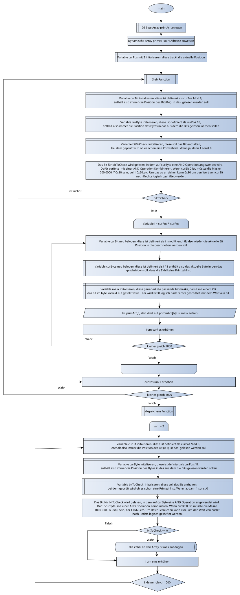

<h1>Primzahlen Sieb</h1>

Idee:
Für das Sieb einen Array bestehend aus 126 Bytes anlegen. 
Den Array, dann für die Zahlen 2-1000 befüllen, die Infos werden dabei in das jeweilige Bit reingeschrieben.
Wenn das Bit eine 1 ist, dann keine Primzahl, wenn das Bit 0 ist Primzahl.

Das Bit kann ermittelt werden, in dem zuerst das Byte ermittelt wird mit Zahl durch 8.
Dann in dem Byte für das Bit BYTE AND 0x80 Shift Rechts gewünschtes Bit (0-7)
Wenn 0 raus kommt, steht in dem Bit eine 0, sonst 1

Der wird mit dem das Byte beschrieben werden soll wird emittelt mit BYTE OR 0x80 Shift Rechts gewünschtes Bit(0-7)

Für das abspeichern, ein Halbwort im Speicher, hinter dem Sieb Array Initialiseren. 
Dann die Primzahlen, hinter das Reservierte Halbwort schreiben, dafür auch Halbwörter benutzen,
Am Ende die Adresse der letzten Primzahl - die Adresse des reservierten Halbwortes ausführen.
Das Ergebnis durch 2, in die Adresse des Halbwortes schreiben. Es handelt sich hiebei um die Anzahl der Primzahlen oder Halbwörter die im Speicher stehen.

Speicher Layout, nach Programm ablauf:
erste 126 Bytes belegt mit dem Sieb
Dann Halbwort belegt mit Anazahl der Elemente
Dann soviele Halbwörter, wie Anzahl der Elemente

Beispiel Flowchart, letzter Punkt ist nicht korrekt abgebildet:

